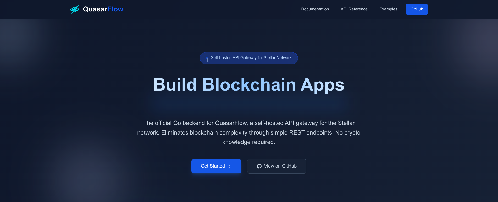

# QuasarFlow Website



> Modern landing page and documentation for QuasarFlow API - Blockchain abstraction API that simplifies Stellar network integration

## About

This is the official website for QuasarFlow API, featuring:

- **Modern Landing Page** - Hero section, features showcase, and call-to-action
- **Comprehensive Documentation** - Getting started guide, API reference, and examples
- **Interactive Examples** - Code samples in multiple languages (JavaScript, Python, Go)
- **Responsive Design** - Mobile-first design with dark mode support
- **SEO Optimized** - Meta tags, structured data, and performance optimized

## Features

- 🚀 **Next.js 15** with App Router
- 🎨 **Tailwind CSS** for styling
- 📱 **Responsive Design** with mobile-first approach
- 🌙 **Dark Mode** support
- 📚 **Documentation** with interactive examples
- 🔗 **API Reference** with detailed endpoints
- 💻 **Code Examples** in multiple programming languages

## Roadmap 2025-2026

### 🚀 Phase 1 - Core Foundation (Q1 2025)

- [x] **Website Development** - Modern landing page with responsive design
- [x] **Basic Documentation** - Getting started guide and API reference
- [x] **SEO Optimization** - Meta tags, structured data, and performance
- [ ] **Go API Backend** - Core blockchain abstraction layer
- [ ] **PostgreSQL Integration** - Database setup and schema design
- [ ] **Stellar Network Integration** - Basic wallet operations

### ⚡ Phase 2 - Advanced Features (Q2 2025)

- [ ] **Authentication System** - JWT-based API authentication
- [ ] **Wallet Management** - Create, import, and manage wallets
- [ ] **Payment Processing** - Send and receive payments
- [ ] **External Wallet Support** - SEP-10 verification
- [ ] **Rate Limiting** - API protection and monitoring
- [ ] **Docker Deployment** - Containerized deployment setup

### 🔧 Phase 3 - Developer Experience (Q3 2025)

- [ ] **SDK Development** - JavaScript, Python, and Go SDKs
- [ ] **Webhook System** - Real-time event notifications
- [ ] **Advanced Documentation** - Interactive API explorer
- [ ] **Testing Suite** - Comprehensive test coverage
- [ ] **CI/CD Pipeline** - Automated testing and deployment
- [ ] **Monitoring & Logging** - Production-ready observability

### 🌟 Phase 4 - Enterprise Features (Q4 2025)

- [ ] **Multi-tenant Support** - Organization and team management
- [ ] **Advanced Security** - AES-256-GCM encryption
- [ ] **Compliance Tools** - KYC/AML integration
- [ ] **Analytics Dashboard** - Usage metrics and insights
- [ ] **White-label Solutions** - Customizable API branding
- [ ] **Enterprise Support** - 24/7 technical support

### 🚀 Future Vision (2026+)

- [ ] **Multi-blockchain Support** - Ethereum, Bitcoin, and more
- [ ] **DeFi Integration** - DEX and lending protocol support
- [ ] **NFT Marketplace** - Token creation and trading
- [ ] **Mobile SDKs** - React Native and Flutter support
- [ ] **GraphQL API** - Modern query interface
- [ ] **AI-powered Analytics** - Predictive insights and recommendations

## Getting Started

### Prerequisites

- Node.js 18+
- npm, yarn, or pnpm

### Installation

1. Clone the repository:

```bash
git clone https://github.com/QuasarAPI/quasarflow-website.git
cd quasarflow-website
```

2. Install dependencies:

```bash
npm install
# or
yarn install
# or
pnpm install
```

3. Run the development server:

```bash
npm run dev
# or
yarn dev
# or
pnpm dev
```

4. Open [http://localhost:3000](http://localhost:3000) with your browser to see the result.

## Project Structure

```
src/
├── app/
│   ├── page.tsx          # Landing page
│   ├── docs/
│   │   └── page.tsx      # Documentation
│   ├── api/
│   │   └── page.tsx      # API Reference
│   ├── examples/
│   │   └── page.tsx      # Code Examples
│   ├── layout.tsx        # Root layout
│   └── globals.css       # Global styles
```

## Pages

### Landing Page (`/`)

- Hero section with value proposition
- Feature highlights
- Use cases showcase
- Call-to-action sections
- Footer with links

### Documentation (`/docs`)

- Getting started guide
- Quick start instructions
- Authentication setup
- Wallet management
- External wallet verification
- Configuration options
- Architecture overview

### API Reference (`/api`)

- Complete API endpoint documentation
- Request/response examples
- Authentication methods
- Error handling
- Status codes

### Examples (`/examples`)

- Basic wallet operations
- Payment flow examples
- External wallet verification
- SDK examples (JavaScript, Python, Go)
- Webhook integration

## Customization

### Styling

The project uses Tailwind CSS for styling. You can customize the design by:

- Modifying the color scheme in `tailwind.config.js`
- Updating component styles in the respective page files
- Adding custom CSS in `globals.css`

### Content

- Update the landing page content in `src/app/page.tsx`
- Modify documentation in `src/app/docs/page.tsx`
- Update API reference in `src/app/api/page.tsx`
- Add new examples in `src/app/examples/page.tsx`

## Deployment

### Vercel (Recommended)

1. Push your code to GitHub
2. Connect your repository to Vercel
3. Deploy automatically

### Other Platforms

The project can be deployed to any platform that supports Next.js:

- Netlify
- AWS Amplify
- Railway
- DigitalOcean App Platform

## Contributing

1. Fork the repository
2. Create a feature branch: `git checkout -b feature/amazing-feature`
3. Make your changes and add tests
4. Commit your changes: `git commit -m 'Add amazing feature'`
5. Push to the branch: `git push origin feature/amazing-feature`
6. Open a Pull Request

## License

This project is licensed under the MIT License - see the [LICENSE](LICENSE) file for details.

## Related Projects

- [QuasarFlow API](https://github.com/QuasarAPI/quasarflow-api) - The main Go backend API project
- [QuasarFlow SDKs](https://github.com/QuasarAPI) - Official SDKs for various languages (planned)

## Repository Information

Based on the [official QuasarFlow API repository](https://github.com/QuasarAPI/quasarflow-api):

- **Language Distribution**: Go (72.2%), Shell (26.9%), Dockerfile (0.9%)
- **Repository Stats**: 0 stars, 2 forks, 10 commits
- **License**: MIT License
- **Architecture**: Clean Architecture with Go 1.21+
- **Database**: PostgreSQL
- **Blockchain**: Stellar Network integration
- **Deployment**: Docker and Docker Compose support

---

**QuasarFlow** - Making blockchain development simple and accessible for everyone.
